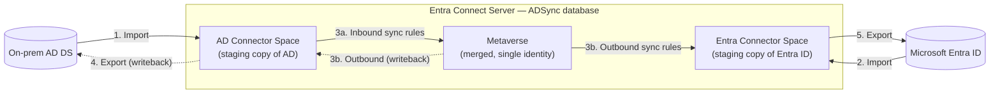
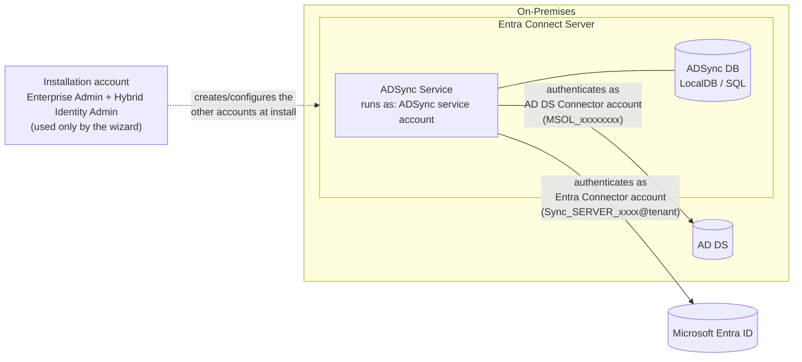
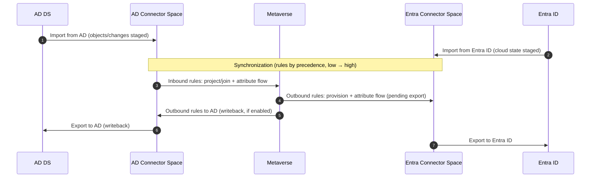
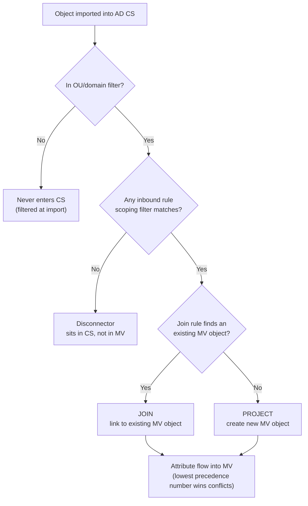
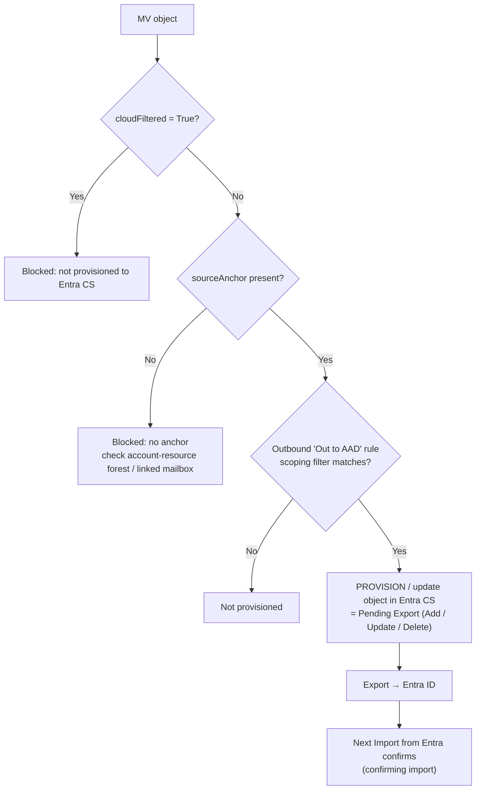
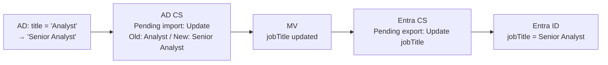
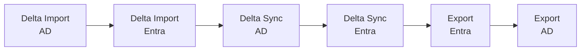
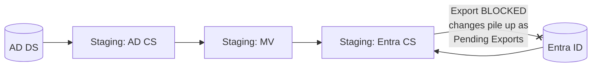
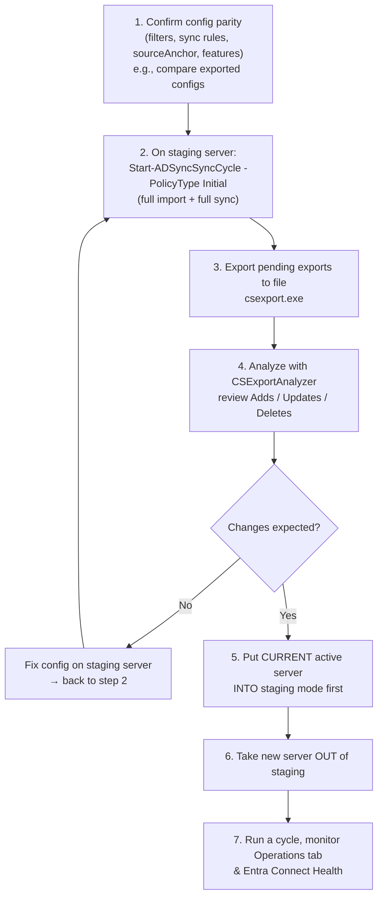
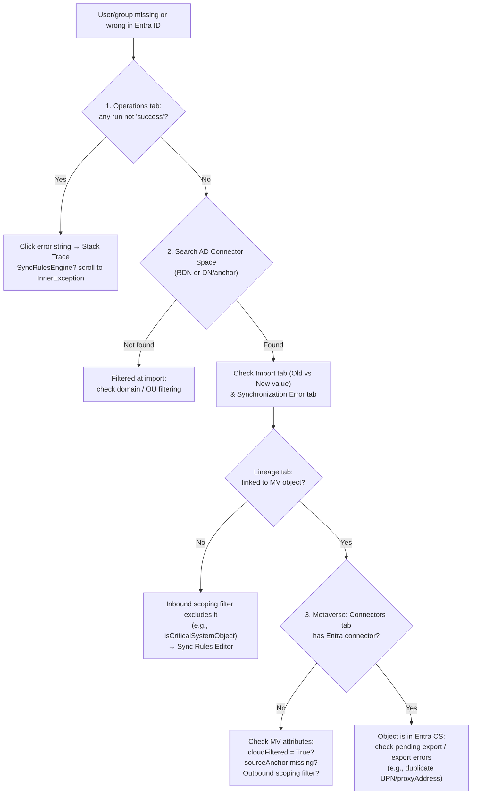

# Microsoft Entra Connect Sync — How Objects Flow (Reference Guide)

> Personal reference for understanding and troubleshooting Entra Connect Sync: how an object moves from **AD DS → AD Connector Space → Metaverse → Entra Connector Space → Entra ID**, which accounts do what, and how to safely promote a staging server.
>
> Primary source: [Troubleshoot an object that is not syncing with Microsoft Entra ID](https://learn.microsoft.com/en-us/entra/identity/hybrid/connect/tshoot-connect-object-not-syncing)

---

## Table of Contents

1. [The Big Picture](#1-the-big-picture)
2. [Key Terminology](#2-key-terminology)
3. [The Accounts](#3-the-accounts)
4. [The 5 Sync Steps](#4-the-5-sync-steps)
5. [Inside the Engine: Connector Space & Metaverse](#5-inside-the-engine-connector-space--metaverse)
6. [Walkthrough: Following "Jane Doe" End-to-End](#6-walkthrough-following-jane-doe-end-to-end)
7. [Run Profiles & the Scheduler](#7-run-profiles--the-scheduler)
8. [Staging Mode & the Golden Rule](#8-staging-mode--the-golden-rule)
9. [Troubleshooting Flow: Object Not Syncing](#9-troubleshooting-flow-object-not-syncing)
10. [Quick Reference Cheat Sheet](#10-quick-reference-cheat-sheet)

---

## 1. The Big Picture

Entra Connect never copies objects straight from AD to Entra ID. Everything passes through **three staging tables** in the ADSync database (SQL LocalDB by default):



**The same flow, step by step:**

| Step | Action | From | To | What happens | Runs on staging server? |
|---|---|---|---|---|---|
| 1 | **Import from AD** | On-prem AD DS | AD Connector Space | The AD DS Connector account reads in-scope users, groups, and contacts. New or changed data is staged as **pending import**. | ✅ Yes |
| 2 | **Import from Entra ID** | Microsoft Entra ID | Entra Connector Space | The Entra Connector account reads what already exists in the tenant, so the engine knows the current cloud state. | ✅ Yes |
| 3a | **Inbound sync** | AD Connector Space | Metaverse | Inbound sync rules decide whether the object is in scope, then either **join** it to an existing MV object or **project** a new one, and flow its attributes in. | ✅ Yes |
| 3b | **Outbound sync** | Metaverse | Entra Connector Space (and AD CS for writeback) | Outbound sync rules **provision** or update the object in the Entra CS. The difference from the current cloud state becomes a **pending export**. | ✅ Yes |
| 4 | **Export to AD** *(writeback only)* | AD Connector Space | On-prem AD DS | Writes back cloud-sourced data, such as password writeback, group writeback, or `ms-DS-ConsistencyGuid`. | ❌ No |
| 5 | **Export to Entra ID** | Entra Connector Space | Microsoft Entra ID | Pending exports are pushed to the tenant, where objects are created, updated, or deleted. The next Entra import confirms they landed. | ❌ No |

> Steps 1, 2, and 3 only read from directories or work inside the database. **Only steps 4 and 5 write to a real directory**, and those are exactly the steps staging mode blocks.

**Mental model:** think of it like an airport.

| Airport analogy | Entra Connect |
|---|---|
| Departure country | On-prem AD DS |
| Departure terminal (passport check) | AD Connector Space |
| International transit hall (everyone merges, identity verified) | Metaverse |
| Arrival terminal (customs staging) | Entra Connector Space |
| Destination country | Microsoft Entra ID |

A passenger can get stopped at **any** gate. Troubleshooting = finding which gate they're stuck at.

---

## 2. Key Terminology

| Term | What it is | Plain-English meaning |
|---|---|---|
| **Connector (Management Agent / MA)** | Config that tells the engine how to talk to one directory | The "adapter" for AD or Entra ID. One per AD forest + one for Entra ID |
| **CS — Connector Space** | A table in the ADSync DB, one per connector | A **local mirror/staging copy** of the connected directory's in-scope objects |
| **MV — Metaverse** | A table in the ADSync DB | The **merged single view** of an identity, built from all connector spaces |
| **Import** | Read from directory → CS | "What does the source look like now?" Changes land as **pending import** |
| **Synchronization** | CS ↔ MV via sync rules | Applies rules: CS → MV (inbound), MV → CS (outbound) |
| **Export** | CS → directory | Pushes **pending exports** to the real directory |
| **Sync rule (inbound / outbound)** | Rules in the Synchronization Rules Editor | Decide scope, join, and attribute flow. Run by **precedence — lower number wins** |
| **Scoping filter** | Condition on a sync rule | Decides if an object is in scope of that rule (e.g., `isCriticalSystemObject` not TRUE) |
| **Projection** | Inbound rule creates a **new** MV object | "Never seen this person before → create them" |
| **Join** | Inbound rule links a CS object to an **existing** MV object | "This is the same person from another forest → merge" |
| **Provision** | Outbound rule creates a **new** object in a target CS | "Create this person in the Entra CS so they can be exported" |
| **Connector vs Disconnector** | CS object linked / not linked to an MV object | Disconnector = sitting in the CS but not participating (filtered, out of scope) |
| **Lineage** | Tab on a CS object | Shows which MV object it's linked to and which rules acted on it |
| **sourceAnchor / ImmutableId** | Immutable key tying on-prem object to cloud object | Default: `ms-DS-ConsistencyGuid` (seeded from `objectGUID`) → `ImmutableId` in Entra |
| **Hard match / Soft match** | How an existing cloud object gets linked | Hard = sourceAnchor/ImmutableId; Soft = UPN or primary SMTP (proxyAddresses) |
| **cloudFiltered** | MV attribute | If `True`, object is blocked from going to Entra ID (attribute-based filtering) |
| **Pending Import / Pending Export** | Staged changes not yet applied | Shows "Old Value" vs "New Value" before being committed |
| **Delta vs Full** | Run type | Delta = only changes since last watermark; Full = re-evaluate everything |

---

## 3. The Accounts

This is where most confusion comes from. There are **four** different identities, each with a distinct job.



| Account | Typical name | Where it lives | Job | Key permissions |
|---|---|---|---|---|
| **ADSync service account** | `NT SERVICE\ADSync` (Virtual Service Account — default), or gMSA / custom domain account | On the Connect server (local) | The **Windows service identity** that runs the sync engine, reads/writes the ADSync DB, and holds the encryption keys that protect the other accounts' credentials | Local; DB owner rights. Not used to talk to AD or Entra directly |
| **AD DS Connector account** | `MSOL_xxxxxxxxxxxx` (express) or custom account | On-prem AD | Account the **AD connector** uses to **read** from AD (import) and **write** to AD (writeback exports) | Read on all in-scope objects; **Replicate Directory Changes + Replicate Directory Changes All** for Password Hash Sync; write perms only for enabled writeback features (password, group, device, Exchange hybrid) |
| **Entra Connector account** | `Sync_<SERVER>_<id>@tenant.onmicrosoft.com` | Entra ID | Account the **Entra connector** uses to import from and export to Entra ID | **Directory Synchronization Accounts** role. Newer Connect builds can use **application-based (certificate) authentication** instead of this user account |
| **Installation account(s)** | Your admin accounts | AD + Entra | Used **only by the wizard** to create the above accounts and configure permissions | Enterprise Admin (express) + Hybrid Identity Administrator. Not needed for day-to-day sync |

> 🔐 **Security engineer lens:** The Connect server is a **Tier 0 asset**. The AD DS Connector account with Replicate Directory Changes All can effectively DCSync password hashes, and the ADSync service can decrypt both connector credentials. Treat the server like a domain controller: restricted admin, no internet browsing, monitored, and `ADSyncAdmins` membership tightly controlled.

**Local groups created on the server:**

| Group | Purpose |
|---|---|
| `ADSyncAdmins` | Full control of Sync Service Manager / config |
| `ADSyncOperators` | Run profiles, view operations |
| `ADSyncBrowse` | Read connector space / MV |
| `ADSyncPasswordSet` | Password management operations |

---

## 4. The 5 Sync Steps

From the Microsoft doc, a sync cycle has five logical steps:



| # | Step | Direction | What actually happens |
|---|---|---|---|
| 1 | **Import from AD** | AD → AD CS | Reads in-scope OUs/domains. Changes staged as **pending import** |
| 2 | **Import from Entra ID** | Entra → Entra CS | Reads cloud state so the engine knows what already exists (and confirms prior exports) |
| 3 | **Synchronization** | CS ↔ MV | **Inbound** rules: CS → MV. **Outbound** rules: MV → CS. Produces **pending exports** |
| 4 | **Export to AD** | AD CS → AD | Only for writeback features (password writeback, group writeback, ms-DS-ConsistencyGuid, Exchange hybrid attributes) |
| 5 | **Export to Entra ID** | Entra CS → Entra | Creates / updates / deletes objects in your tenant |

> 💡 **Key insight:** Synchronization **never touches a real directory**. Only Import reads and only Export writes. Sync is purely database-to-database inside the server. This is exactly why staging mode is safe — see [Section 8](#8-staging-mode--the-golden-rule).

---

## 5. Inside the Engine: Connector Space & Metaverse

### 5.1 How an object gets into the metaverse (inbound)



### 5.2 How an object gets to Entra ID (outbound)



### 5.3 Why both connector spaces exist

| Question | Answer |
|---|---|
| Why not sync AD straight to Entra? | Multiple forests may contribute to one person. The MV merges them into one identity and resolves attribute conflicts by precedence |
| Why import from Entra ID at all? | So the engine can compare desired state (MV) vs actual state (Entra CS) and only export the **difference**. Also confirms exports actually landed |
| What does the Entra CS represent? | "What Entra ID **should** look like after export", plus objects already there |

---

## 6. Walkthrough: Following "Jane Doe" End-to-End

**Scenario:** HR creates `Jane Doe` in `OU=Staff,DC=contoso,DC=com`. That OU is in sync scope. Password Hash Sync is on.

| Stage | Where Jane is | What you'd see in Synchronization Service Manager |
|---|---|---|
| **0. Created in AD** | AD DS only | Nothing yet |
| **1. Delta Import (AD)** | AD CS — *pending import: Add* | Operations → AD connector → Delta Import → `Adds: 1` |
| **2. Delta Sync (AD)** | AD CS **→** MV. "In from AD – User Join" finds no match → **"In from AD – User Common" projects** a new MV `person`. `ms-DS-ConsistencyGuid` (or `objectGUID`) flows into MV `sourceAnchor` | CS object Lineage tab shows a **Provision** action on the inbound rule. MV now has Jane |
| **3. Outbound rules evaluate (same sync run)** | MV **→** Entra CS. "Out to AAD – User Join" provisions Jane to the Entra CS → **pending export: Add** | Entra connector Search CS → Scope: **Pending Export** → Jane listed as Add |
| **4. Export (Entra)** | Entra CS → Entra ID. Jane is created with `ImmutableId` = base64 of the sourceAnchor | Operations → Entra connector → Export → `Adds: 1` |
| **5. Delta Import (Entra)** | Confirming import | Pending export clears. Jane is fully "joined" across AD CS ↔ MV ↔ Entra CS |
| **6. PHS** | Password hash flows separately (every ~2 min), outside the main cycle | CS object → **Log** button shows password sync history |

**Now Jane's title changes in AD:**



**Now Jane's OU is removed from scope:** she becomes out of scope in the AD CS → MV object loses its contributing connector → outbound rule de-provisions → **pending export: Delete** in Entra CS → Jane is soft-deleted in Entra ID. (This is why OU filter changes in staging should be verified first!)

---

## 7. Run Profiles & the Scheduler

| Run profile | Does | When used |
|---|---|---|
| **Full Import** | Re-reads every in-scope object from the directory | After filtering changes, schema refresh, first run |
| **Delta Import** | Reads only changes since last watermark (AD uses USN/DirSync cookie) | Every normal cycle |
| **Full Synchronization** | Re-applies **all** sync rules to **all** CS objects | After sync rule changes |
| **Delta Synchronization** | Applies rules only to objects with pending changes | Every normal cycle |
| **Export** | Pushes pending exports | Every normal cycle (suppressed in staging mode) |

**Default delta cycle (every 30 min):**



| PowerShell | Purpose |
|---|---|
| `Get-ADSyncScheduler` | Check interval, `SyncCycleEnabled`, `StagingModeEnabled` |
| `Start-ADSyncSyncCycle -PolicyType Delta` | Run a delta cycle now |
| `Start-ADSyncSyncCycle -PolicyType Initial` | Full import + full sync on all connectors |
| `Set-ADSyncScheduler -SyncCycleEnabled $false` | Pause the scheduler (do this before maintenance) |
| `Get-ADSyncConnectorRunStatus` | Is a run currently in progress? |

> ⚠️ **Export deletion threshold:** by default Connect stops exporting if a single run would delete **more than 500** objects (`stopped-deletion-threshold-exceeded`). This is a safety net — don't disable it casually. Investigate first.

---

## 8. Staging Mode & the Golden Rule

### 8.1 What staging mode does

| Run step | Active server | Staging server |
|---|---|---|
| Import from AD | ✅ | ✅ |
| Import from Entra ID | ✅ | ✅ |
| Synchronization | ✅ | ✅ |
| Export to Entra ID / AD | ✅ | ❌ **Suppressed** |
| Password Hash Sync / writeback | ✅ | ❌ |

Because only exports are suppressed, a staging server builds a **complete, real list of what it *would* change** — it sits in the Entra CS (and AD CS) as **pending exports**.



### 8.2 🥇 The Golden Rule

> **Never take a staging server out of staging mode until you've verified its pending exports to Entra ID are exactly what you expect.**

**Why:** the moment staging is disabled, the next cycle exports **everything** pending. If the staging server has a different OU filter, a missing/edited sync rule, a different sourceAnchor setting, or a stale config, those pending exports could be **thousands of updates or deletes** hitting production identities: users losing licenses, groups emptied, accounts soft-deleted. Pending exports are the server telling you exactly what it will do — read them before you pull the trigger.

**Example of what goes wrong:** the staging server was built months ago and nobody added `OU=Contractors` to its filter. Active server syncs contractors fine. You flip staging → the staging server sees 1,200 contractors in the Entra CS with no matching MV object → **1,200 pending deletes** → contractors lose access on Monday morning (or the 500 deletion threshold saves you).

### 8.3 Safe switchover procedure



> Order matters in steps 5–6: put the old active into staging **first** so you never have two servers exporting at once.

### 8.4 Verifying pending exports — commands

Run from `C:\Program Files\Microsoft Azure AD Sync\Bin` on the **staging** server:

```powershell
# 1. Find the exact Entra connector name (e.g. "contoso.onmicrosoft.com - AAD")
Get-ADSyncConnector | Select-Object Name, Type

# 2. Dump pending exports from the Entra connector space to XML
.\csexport.exe "contoso.onmicrosoft.com - AAD" "$env:TEMP\export.xml" /f:x

# 3. Convert to CSV for review in Excel
.\CSExportAnalyzer.exe "$env:TEMP\export.xml" > "$env:TEMP\export.csv"
```

You can also eyeball it in the GUI: **Connectors → Entra connector → Search Connector Space → Scope: Pending Export → check Add / Modify / Delete**.

**What to look for in the CSV:**

| Operation | Ask yourself |
|---|---|
| **Add** | Should these objects exist in Entra? Or is a filter broader than the active server's? |
| **Update** | Which attributes? A bulk change to `userPrincipalName`, `proxyAddresses`, or `sourceAnchor` is a red flag |
| **Delete** | ⚠️ Highest risk. Any non-trivial number of deletes needs an explanation before go-live |

A healthy staging server that matches the active server should have **near-zero** pending exports to Entra ID (the active server already exported those changes).

---

## 9. Troubleshooting Flow: Object Not Syncing

Microsoft's recommended order: **Operations → Connector Space → Metaverse**.



| Status (Operations tab) | Meaning | Priority |
|---|---|---|
| `stopped-*` | Run couldn't finish (e.g., remote system down) | 1 |
| `stopped-error-limit` | > 5,000 errors, run auto-stopped | 2 |
| `completed-*-errors` | Finished with < 5,000 errors | 3 |
| `completed-*-warnings` | Data not in expected state — fix errors first; warnings are often symptoms | 4 |
| `success` | No issues | — |

**Other handy tools from the doc:**

| Tool | Where | Use |
|---|---|---|
| **Preview** | CS object → Preview | Simulate Full/Delta sync for **one object**. *Generate Preview* = in-memory only; *Commit Preview* = actually updates MV and stages exports |
| **Log** | CS object → Log | Password Hash Sync history for that object |
| **Pending Import + Add** search | Entra connector → Search CS | Finds **orphans**: objects in Entra not linked to any on-prem object (created by another sync engine or different filter config) |
| **Metaverse Search** | Sync Service Manager | Search by `accountName` / `userPrincipalName` |
| **Troubleshooting task** | Entra Connect wizard (v1.1.749.0+) | Guided object sync diagnostics |

---

## 10. Quick Reference Cheat Sheet

| If the object is… | It's stuck at… | Look at… |
|---|---|---|
| Not in AD CS | Import filter | Domain / OU filtering |
| In AD CS, not in MV | Inbound rules | Inbound scoping filters, sync errors on CS object |
| In MV, not in Entra CS | Outbound rules | `cloudFiltered`, `sourceAnchor`, outbound scoping filters |
| In Entra CS with pending export | Export | Export errors (duplicate attributes), deletion threshold, staging mode on? |
| In Entra, not linked to on-prem | Matching | Hard match (ImmutableId) / soft match (UPN, SMTP); orphan search |

**Five things to remember:**

1. **Import reads, Export writes, Sync stays inside the database.**
2. **Inbound = CS → MV. Outbound = MV → CS.** Rules run by precedence; **lower number wins**.
3. **The MV is the single merged identity**; connector spaces are per-directory staging copies.
4. **ADSync service account runs the engine; AD DS Connector account talks to AD; Entra Connector account talks to Entra.**
5. **Staging = everything except export.** Read the pending exports (csexport + CSExportAnalyzer) before going active.

---

### References

- [Troubleshoot an object that is not syncing with Microsoft Entra ID](https://learn.microsoft.com/en-us/entra/identity/hybrid/connect/tshoot-connect-object-not-syncing)
- [Microsoft Entra Connect Sync: Understand the architecture](https://learn.microsoft.com/en-us/entra/identity/hybrid/connect/concept-azure-ad-connect-sync-architecture)
- [Microsoft Entra Connect: Accounts and permissions](https://learn.microsoft.com/en-us/entra/identity/hybrid/connect/reference-connect-accounts-permissions)
- [Microsoft Entra Connect Sync: Operational tasks (staging mode)](https://learn.microsoft.com/en-us/entra/identity/hybrid/connect/how-to-connect-sync-staging-server)
- [Microsoft Entra Connect Sync: Configure filtering](https://learn.microsoft.com/en-us/entra/identity/hybrid/connect/how-to-connect-sync-configure-filtering)
- [Microsoft Entra Connect Sync: Scheduler](https://learn.microsoft.com/en-us/entra/identity/hybrid/connect/how-to-connect-sync-feature-scheduler)
